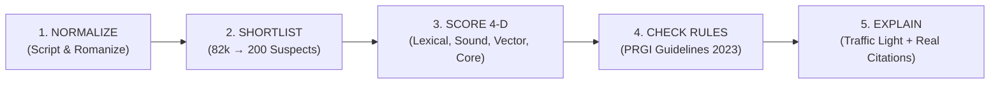

# PRGI TitleGuard • Automated Press Title Verification & Agentic System
> **Smart India Hackathon • Problem Statement PSS06: Automated Press Title Admissibility Clearance**  
> **Repository:** `https://github.com/divvyesk/prgi-title-verify`

---

## 🏛️ Executive Summary

Under the **Press and Registration of Periodicals Act, 2023**, the **Press Registrar General of India (PRGI)** must verify every proposed periodical and newspaper title against **82,713 existing registered titles**.

### Key Problem Challenges Solved:
1. **Word Order / Anagram Variations:** Detecting collisions like *Times India* vs registered *India Times*.
2. **Phonetic Spelling Shifts:** Detecting sounding equivalents like *Jaagran Weekly* vs registered *Jagran*.
3. **Cross-Lingual Semantic Concept Collisions:** Matching *Dainik Samachar* vs registered *Daily News* or *Vivah Suchi* vs *Matrimonial List*.
4. **Prefix / Suffix & Core Root Collisions:** Stripping media stop words (*The, Daily, Patrika, Express, News*) so *The Vidarbha Daily Express* immediately collides with registered *Vidarbha Patrika* on the root token *vidarbha*.
5. **Deterministic Statutory Rule Violations:** Rule 4.1a commercial/matrimonial catalog ban, Rule 3.2b internet domain/URL ban, Rule 1.1a single generic word ban, Rule 7.2a character length limits, and Emblems and Names Act.

---

## 🏗️ 3-Layer System Architecture & Work Division

```mermaid
graph TD
    subgraph Layer 3 — Application & Agents
        M6["Frontend & 3D Verification Console (Vite / React / Tailwind)"]
        M1["FastAPI Orchestrator Gateway (/v1/verify)"]
        M5["Agentic Studio (Interviewer → Gen → Verifier → Ranker)"]
    end

    subgraph Layer 2 — AI/ML & Rules
        M2["NLP/ML 4-D Similarity Engine (Lexical, Sound, Semantic, Core)"]
        M4["Deterministic Statutory Rules & Legal Citations (PRGI 2023)"]
    end

    subgraph Layer 1 — Data & Candidate Search
        M3["PostgreSQL + pgvector HNSW Index (82,713 Titles)"]
    end

    M6 <--> M1
    M1 <--> M3
    M1 <--> M2
    M1 <--> M4
    M5 <--> M1
```

---

## ⚡ 5-Stage Verification Pipeline



1. **Stage 1 (Normalize & Romanize):** Detects Indic scripts (Devanagari, Bengali, Tamil, Telugu, Gujarati, Urdu) and standardizes Roman phonetic tokens.
2. **Stage 2 (Candidate Shortlist):** Parallel lexical + pgvector HNSW shortlist over 82,713 titles.
3. **Stage 3 (4-Dimensional Similarity Scoring):** Computes Lexical (0–100%), Phonetic (0–100%), Semantic Multilingual (0–100%), and Core Root Token (0–100%) collision scores.
4. **Stage 4 (Deterministic Rule Checks):** Evaluates character limits, commercial term bans, URL syntax, and Emblems Act.
5. **Stage 5 (Explain & Advise):** Generates Traffic Light verdict (`APPROVED` 🟢, `MANUAL_REVIEW` 🟡, `REJECTED` 🔴) with real legal citations and actionable recommendations.

---

## 🚀 Quick Start Guide

We provide two separate execution paths:
- **Path A: Fast Local Development (No Docker)** — Starts in **30 seconds** (recommended for laptops & demos).
- **Path B: Full Docker Container Stack** — Multi-container production stack with PostgreSQL pgvector.

---

### Path A: Fast Local Development (No Docker — Starts in 30 Seconds)

> **Why this path:** The full ML Docker container can take 15+ minutes to build on a laptop (downloading PyTorch and BGE-M3 models). The no-Docker path launches the entire local stack in under 30 seconds using native environments.

#### One-Command Runner:
```bash
./scripts/dev.sh
```

#### Or Run in 3 Separate Terminal Tabs:

**Terminal 1 — Database (if using local PostgreSQL with pgvector):**
```bash
psql -U postgres -d prgi -f data/datasets/dataset1/database/01_schema.sql
```

**Terminal 2 — FastAPI Backend (Port 8000):**
```bash
cd backend
export PYTHONPATH="..:."
export STUB_MODE=1
python3 -m uvicorn app.main:app --host 127.0.0.1 --port 8000 --reload
```

**Terminal 3 — Vite Frontend (Port 5173):**
```bash
cd frontend
npm install
npm run dev
```

Open **`http://localhost:5173`** in your browser.

---

### Path B: Full Docker Stack (Production Containers)

1. **Copy environment variables template:**
   ```bash
   cp infra/.env.example infra/.env
   ```

2. **Validate the compose file:**
   ```bash
   docker compose -f infra/docker-compose.yml config
   ```

3. **Start the complete stack:**
   ```bash
   docker compose -f infra/docker-compose.yml down -v
   docker compose -f infra/docker-compose.yml up --build
   ```

**Services Launched:**
| Service | Image / Context | Port | Healthcheck |
| :--- | :--- | :--- | :--- |
| **`db`** | `pgvector/pgvector:pg17` | `5432` | `pg_isready` check on init |
| **`backend`** | `../backend` (FastAPI) | `8000` | HTTP GET `/v1/health` |
| **`frontend`** | `../frontend` (Vite / React) | `5173` | Starts after backend is up |

---

## 🛠️ Troubleshooting Guide

### 1. Port Already in Use (`8000`, `5173`, or `5432`)
If a port collision occurs:
```bash
# Find process using the port (e.g. 8000 or 5173)
lsof -i :8000
lsof -i :5173
lsof -i :5432

# Terminate lingering process
kill -9 <PID>
```
Or specify alternate ports in `infra/.env` (e.g. `PORT=8001`, `FRONTEND_PORT=5174`).

---

### 2. Database Not Ready on Boot
PostgreSQL can accept TCP handshakes moments before the catalog is fully initialized.  
- In Docker, our `docker-compose.yml` includes an explicit `healthcheck` (`pg_isready -U postgres -d prgi`) and `depends_on: db: condition: service_healthy` so FastAPI will never start against an unready database.
- For local dev, verify PostgreSQL is running: `pg_isready -h localhost -p 5432`.

---

### 3. Model Download Slow on First Run
- Running full ML semantic search downloads BGE-M3 embedding weights (~2.2 GB).
- For rapid testing and demos without internet dependency, start with `STUB_MODE=1` (or click **Offline Engine** in the UI header). This runs the embedded heuristic engine with 0 latency.

---

### 4. Cross-Origin Resource Sharing (CORS)
- In development, the Vite dev server uses a zero-CORS reverse proxy forwarding all `/api/*` traffic directly to `http://localhost:8000`.
- If connecting the frontend directly to an external backend host, configure `VITE_API_BASE=http://<host>:8000` in `frontend/.env`.

---

## 🧪 Testing & Validation

```bash
# Test Frontend Build
cd frontend && npm run build

# Test 4-State Error Handling & Fallbacks
node frontend/src/tests/test_all_states.mjs

# Test API Contracts
pytest backend/tests/
```
