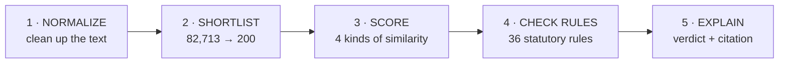

# PRGI TitleGuard

**Checking whether a newspaper title is already taken, in about two seconds instead of a month.**

Smart India Hackathon 2026 · Problem Statement PSS06 · Team 404 Found

[**Try it live →**](https://prgi-title-verify.vercel.app)

---

## The problem

If you want to start a newspaper or magazine in India, the law says your title has to be genuinely new. The Press Registrar General of India has to check your proposed title against **82,713 titles that already exist**, and today that check is largely manual. It takes somewhere between 25 and 30 days.

The hard part isn't spotting exact copies. It's everything close to a copy:

| What slips through | Example |
| :--- | :--- |
| Shuffled words | *Times India* vs the registered *India Times* |
| Different spelling, same sound | *Namascar Bharat* vs the registered *Namaskar* |
| Same meaning, different language | *Dainik Samachar* vs the registered *Daily News* |
| A generic word bolted on | *The Vidarbha Daily Express* vs the registered *Vidarbha Patrika* |
| Words the rules simply ban | Anything containing *Police*, *Army*, *Crime*, *Corruption* |

A human reviewer catches these by knowing the register well. That knowledge is hard to scale and slow to apply.

## What this does

You type a title. Two seconds later you get one of three answers, and the reason behind it.

🟢 **Approved** · nothing close enough to worry about
🟡 **Manual review** · borderline, an officer should look
🔴 **Rejected** · it clashes, and here's exactly which title or which rule

The reason matters as much as the verdict. Every rejection quotes the actual PRGI guideline text it rests on, and names the registered title it collided with. No black box.

**One thing we want to be clear about: this system recommends. It never decides.** The PRGI officer holds the legal authority, exactly as the Act requires. What we removed is the waiting and the guessing, not the judgement.

## How it works

Five stages, running in order:



**1 · Normalize.** Indic scripts (Devanagari, Bengali, Tamil, Telugu, Gujarati, Urdu) get romanized so everything is comparable.

**2 · Shortlist.** Comparing your title against all 82,713 would be slow, so four different search methods each grab their best guesses, and the results get merged into roughly 200 candidates worth a closer look. Using four methods matters, because each catches something the others miss:

- *Trigram* finds misspellings by matching character chunks
- *BM25* finds shared keywords
- *Phonetic* finds titles that sound alike
- *Vector* finds titles that mean the same thing in another language

**3 · Score.** Each of the 200 candidates gets scored on four separate scales: spelling, sound, meaning, and root word. Those four blend into one number between 0 and 100.

**4 · Check rules.** 36 statutory checks run against the title itself, independent of what's in the register. Banned words, generic-word-only titles, government body names, that sort of thing.

**5 · Explain.** The verdict is assembled, and a language model writes the plain-English reason. It's only allowed to cite guideline text that was actually retrieved from the rulebook, so it can't invent a rule that doesn't exist.

## The numbers

Measured against the real 82,713-title database, not estimated:

| | |
| :--- | :--- |
| Titles indexed | 82,713 |
| Shortlist recall | 100% (160/160 tested variations found their original) |
| Statutory rules implemented | 36 |
| Of those, citation-verified against real PRGI text | 29 (the other 7 are flagged, not hidden) |
| Response time, cached | ~13 ms |
| Response time, a title nobody has typed before | ~2.6 s |

The recall test worked by taking real registered titles and deliberately mangling them: shuffling the words, adding a prefix, introducing typos, and all three at once. In every case the original still surfaced in the shortlist.

## Running it yourself

Three pieces need to be running: a database, the backend, and the frontend.

### 1. Database

```bash
./scripts/bootstrap_db.sh
```

This creates the database, applies the migrations in the right order, loads all 82,713 titles, fills in phonetic codes, and builds the search indexes. It's safe to run again; it skips whatever is already done.

Don't run the `.sql` files yourself in filename order. `02_indexes.sql` needs an extension that `03_phonetic.sql` creates, so going alphabetically fails. The script handles that.

Embeddings are optional (`./scripts/bootstrap_db.sh --embeddings`). They take about 25 minutes and only the vector retriever uses them; the other three cover the whole database without. **Don't run this during a demo.** It competes with the backend for the GPU badly enough that a 5-second verification took 194 seconds while it was running.

### 2. Backend

```bash
cd backend && export PYTHONPATH="..:." && python3 -m uvicorn app.main:app --port 8000
```

Settings come from `backend/.env`. Set `STUB_MODE=0` and point `DATABASE_URL` at the database you just built. (`STUB_MODE=1` serves fixed sample data and needs no database at all, which is handy for frontend work.)

**Check the startup log says `registry ready: 4/4 scorers, 4/4 retrievers`.** Anything less means a piece failed to load quietly. The server will still answer requests, just with less of the pipeline actually running, which is worse than an obvious crash. Also worth grepping the log for `falling back`.

### 3. Frontend

```bash
cd frontend && npm install && npm run dev
```

Open **http://localhost:5173**.

### Or use Docker

```bash
cp infra/.env.example infra/.env
docker compose -f infra/docker-compose.yml up --build
```

Worth knowing what this gives you: the containers come up wired together correctly, but the database is **empty**. Compose only creates the schema. For anything real, run `scripts/bootstrap_db.sh` against it and set `STUB_MODE=0`.

## How it's deployed

The live version runs across three free services:

| Piece | Where | Why there |
| :--- | :--- | :--- |
| Frontend | Vercel | Static files, nothing special needed |
| Backend | Render | Needs a server process that stays alive |
| Database | Neon | Postgres with the pgvector extension |

The backend can't go on Vercel. Vercel runs short-lived functions that start and stop per request, and this backend keeps a database connection pool open and (normally) a 2 GB model loaded in memory. That doesn't survive being restarted constantly.

**A real limitation, stated plainly:** Render's free tier gives 512 MB of RAM, and the BGE-M3 embedding model needs 2 to 3 GB. It doesn't fit. The live deployment runs with `DISABLE_SEMANTIC=1`, which skips that model entirely and runs on the other three retrievers and three scorers. Everything else is real: the actual database, all 36 rules, real duplicate detection, real generated explanations. What you lose is cross-language matching, so *Dainik Samachar* vs *Daily News* won't be caught on the hosted version. Run it locally and that comes back.

The verdict thresholds were re-tested without the semantic dimension and still get 10 out of 10 on the calibration set, so nothing needed retuning.

## Running the tests

```bash
pytest tests/                              # 127 backend tests
pytest tests/golden/runner.py              # 51 scorer accuracy cases
node frontend/src/tests/test_all_states.mjs   # frontend states
cd frontend && npm run build               # typecheck + build
```

## Who built what

Six people, six areas:

| Area | Owner |
| :--- | :--- |
| Frontend and the verification console | Gurpreet |
| Officer docket and registry explorer UI | Darsh |
| FastAPI backend and the 5-stage pipeline | Divvye |
| Similarity scoring | Jai |
| Database, search retrievers, rule data | Pruthviraj |
| Agentic Title Studio and RAG explanations | Suhani |

## If something breaks

**Port already in use.** `lsof -i :8000` to find what's holding it, then `kill -9 <PID>`.

**Frontend shows "Offline Engine" instead of "Live".** It couldn't reach the backend and fell back to local sample data. Check the backend is actually running, and open the browser console: a CORS error means `CORS_ORIGINS` in the backend's environment doesn't list the frontend's exact URL.

**First run is slow.** The embedding model is a 2.2 GB download. Set `STUB_MODE=1` to skip it entirely while you're working on other things.

**Everything returns a verdict but no rules ever fire.** Check the startup log for `falling back`. The pipeline is built to degrade instead of crash when a component is missing, which is good for reliability and bad for noticing breakage. Treat those log lines as alarms.

---

*Built for Smart India Hackathon 2026 under the Press and Registration of Periodicals Act, 2023.*
